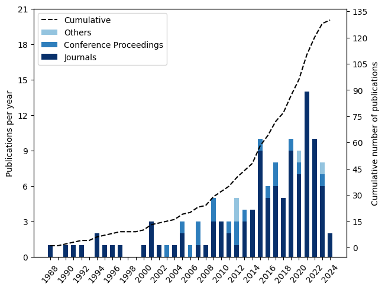

 

# BibVisualizationExpress

BibVisualizationExpress is a small Python library for quick visualizing bibliographic data. 
It is build on top of [pybliometrics](https://github.com/pybliometrics-dev/pybliometrics), a Scopus API for python.  
Currently this library provides three functions for visualization:

`plot_records_over_time()` 

`plot_world_map_country_count()`

`plot_keyword_worldcloud()`

## Usage
Check out the [example notebook](examples/generate_figures.ipynb), which gives a good overview.

## Contributing
If you like the library feel free to contribute!

## License
MIT license, see [LICENSE](LICENSE)
